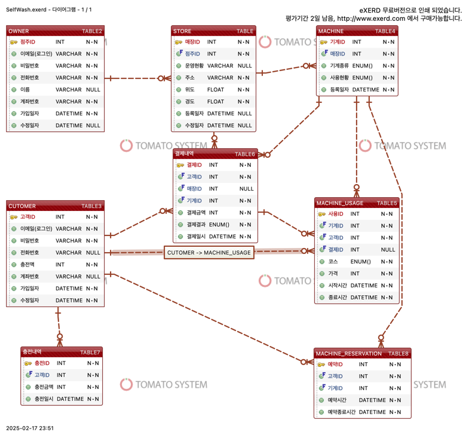

 셀프 빨래방 프로젝트

위치 기반으로 주변 셀프 래방을 조회하고, 기계 예약 및 사용을 간편하게 할 수 있는 서비스입니다.

## 프로젝트 기능 및 설계

### 회원가입 및 로그인

- **공통 기능**
    - 사용자 유형 (관리자 / 가맹점주 / 고객)
    - 회원가입 및 로그인
    - 비밀번호 찾기 및 변경

### 가맹점주 기능

- **빨래방 관리**
    - 빨래방 등록 / 수정 / 삭제
    - **위 과정 진행시 관리자 승인**이 필요
- **문의사항 관리**
- 메일을 통해서 문의사항 접수 및 답변

**고객 기능**

- **빨래방 조회**
    - **위치 기반**으로 주변 무인 빨래방 조회
    - (카카오맵 api를 이용, 위도와 경도 정보를 통해 설정 위치에서 500m 내에 있는 빨래방 목록 조회)
      
- 빨래방 **기계 사용 현황** 확인 
    - 빨래방 기계 사용현황 조회
    - (redis에 실시간 사용현황을 저장하고 현황 조회 시 redis에서 불러옴. 사용기록은 sql에 저장)
      
- **기계 예약**
    - 사용 가능한 기계 예약 가능
        - 예약 후 **15분 내 사용** 필수
        - 15분 내 미사용 시 예약 자동 취소
          
- **알림 신청**
    - 원하는 기계가 사용 가능 상태가 되면 알림 수신 신청 가능 (fcm을 통해 알림 구현)
      
- **기계 사용**
    - 예약한 경우
        - 예약한 기계는 코스 선택 후 사용 가능 (로그인 ID 정보와 예약자 ID정보와 일치해야 예약 사용 가능)
        - 선택 가능 코스
            - 세탁기: 헹굼/탈수 횟수 선택
            - 건조기: 온도/시간 선택
    - 예약하지 않은 경우
        - **사용 가능한 기계**를 선택 후 코스 설정 및 결제 진행.
    - 선택한 코스에 따라 결제 금액 계산
      
- **결제**
    - 충전식 결제 방식
    - 사용 전 금액 충전 필요
      
- **문의사항 접수**
    - 매장 사용 중 문의사항 발생 시 점주에게 문의 가능 (문의신청하면 메일로 보내짐)

**3. 관리자 기능**

- **빨래방 승인 관리**
    - 가맹점주의 빨래방 등록/수정/삭제 요청 승인 또는 거절
## ERD 

## Trouble Shooting
[go to the trouble shooting section](doc/TROUBLE_SHOOTING.md)
